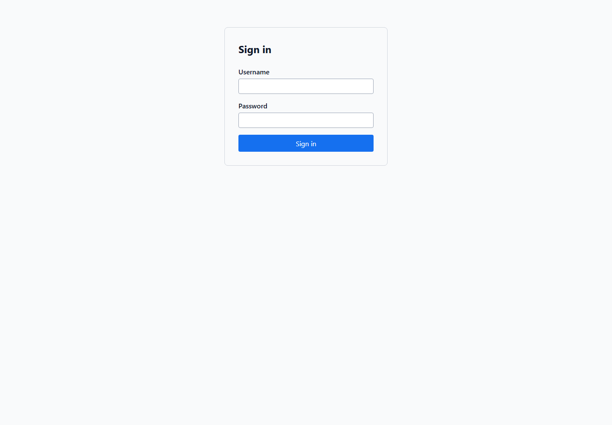
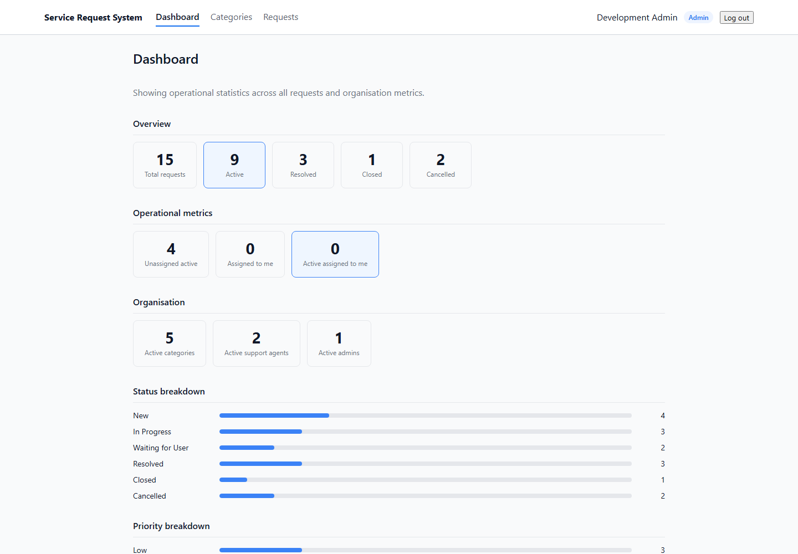
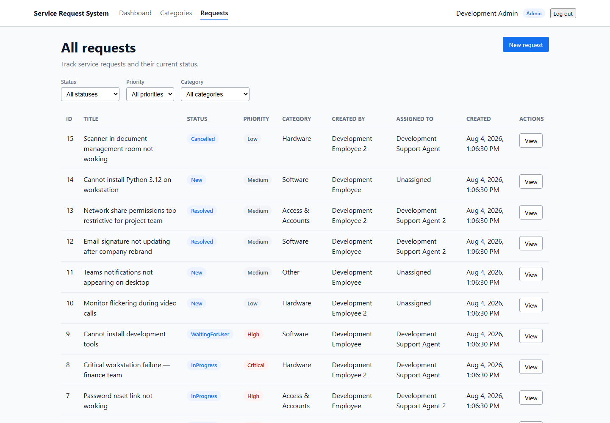
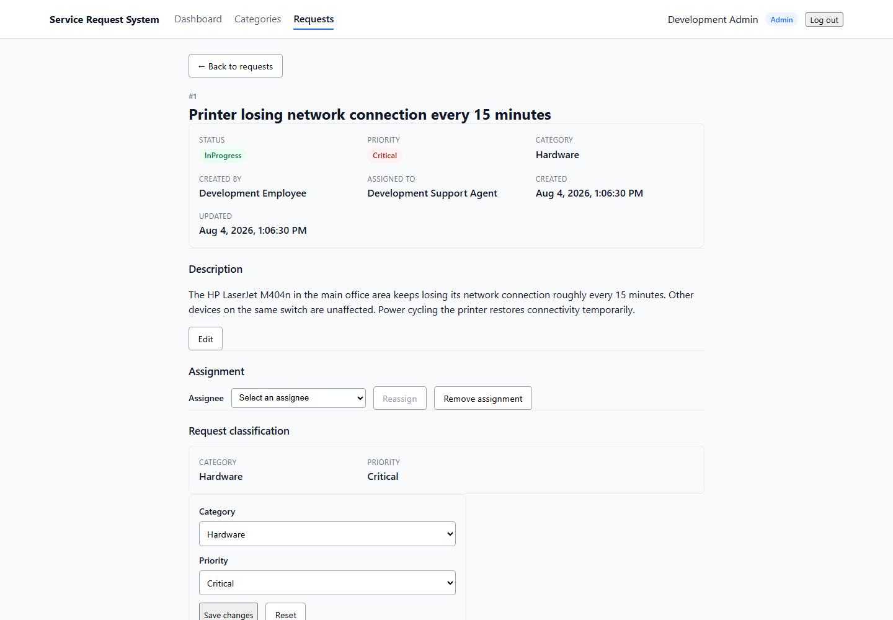
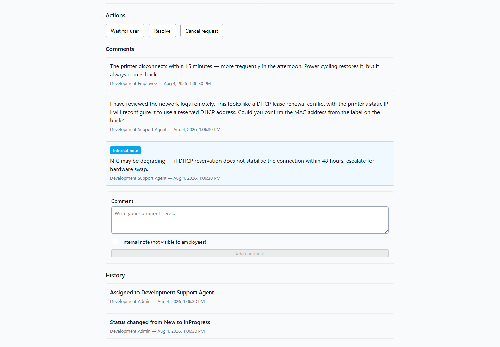
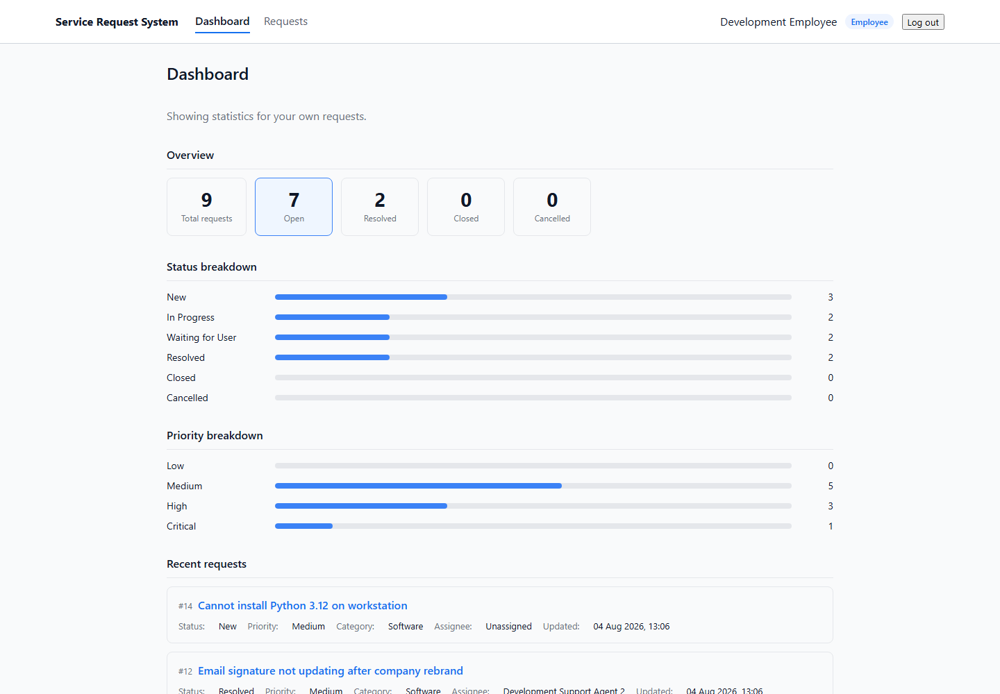

# Service Request System

A full-stack IT service desk application demonstrating role-based request management, secure
backend authorization, a complete request lifecycle, and automated testing across all layers.

---

## Highlights

- **Role-differentiated workflows** — Employees, Support Agents, and Admins each see and can do
  exactly what their role allows; all authorization is enforced server-side independently of what
  the UI exposes.
- **Audit trail** — every status change, assignment, classification update, and content edit is
  recorded atomically in the same database transaction as the mutation that caused it.
- **Internal notes** — support staff can attach internal comments that are never returned to
  employee callers, enforced at the API level on every response.
- **Layered architecture** — a Domain/Application/Infrastructure/API split keeps business rules
  decoupled from persistence, tested independently, and easy to follow.
- **506 backend tests / 268 Angular tests** — domain-rule unit tests, real-database integration
  tests through the full HTTP stack, and Angular component and service tests.

---

## Screenshots

> Screenshots are captured against the seeded development database.

**Login**



**Admin dashboard — full overview with agent workload and status breakdown**



**Request list — admin view showing all 15 seeded requests with filters**



**Request details — admin view with management controls**



**Comments and history — agent view showing internal note and audit trail**



**Employee dashboard — scoped to the signed-in employee's own requests**



---

## Roles and permissions

| Action | Employee | SupportAgent | Admin |
|---|:---:|:---:|:---:|
| View own requests | ✓ | — | — |
| View all requests | — | ✓ | ✓ |
| Create request | ✓ | ✓ | ✓ |
| Edit own New request (title/description) | ✓ | — | — |
| Edit assigned non-terminal request | — | ✓ | — |
| Edit any non-terminal request | — | — | ✓ |
| Assign to self | — | ✓ | — |
| Assign to any active staff | — | — | ✓ |
| Change status (own, allowed transitions) | ✓ | ✓* | ✓ |
| Edit category and priority | — | ✓* | ✓ |
| View public comments | ✓ | ✓ | ✓ |
| View internal notes | — | ✓ | ✓ |
| Post public comment | ✓ | ✓ | ✓ |
| Post internal note | — | ✓ | ✓ |
| Manage categories (create/edit/deactivate) | — | — | ✓ |
| View role-aware dashboard | ✓ | ✓ | ✓ |

\* SupportAgent must be the current assignee of the request.

---

## Main features

**Authentication** — JWT Bearer authentication with role claims. Signing key is validated at
startup and never committed to source control.

**Request lifecycle** — `New → InProgress → WaitingForUser / Resolved → Closed`; cancellation
allowed from most states. Status transitions are enforced by a domain policy; the API rejects
invalid transitions regardless of caller.

**Assignments** — Employees have no assignment controls. Support Agents can self-assign or
remove their own assignment. Admins can assign to any active staff member, reassign, or remove.
Moving to InProgress requires an assignee.

**Classification** — Category and priority are editable by staff on non-terminal requests.
Category changes are restricted to active categories; request history references are preserved
even after a category is deactivated.

**Content editing** — Title and description are independently editable within role and status
constraints. Both are normalized (trimmed) and no-op updates produce no history entry.

**Audit history** — Every change produces a `RequestHistory` record containing the action,
previous value, new value, actor, and timestamp. Description history stores summaries only
(whitespace collapsed, capped at 120 characters); full descriptions are not recorded in history.

**Comments and internal notes** — Threaded comments on every request. Internal notes are
stored as a boolean flag and excluded from employee API responses at the query level.

**Dashboard** — Role-aware summary statistics. Employees see their own counts. Staff see
overall counts by status. Admins see additional agent-workload metrics.

**Category administration** — Admins can create, edit, and deactivate categories. Deactivated
categories are hidden from new-request creation but remain resolvable in history.

---

## Architecture

The backend follows a layered architecture with strict boundaries:

```text
ServiceRequest.Api              HTTP entry point — controllers, middleware, auth
ServiceRequest.Application      Application services, DTOs, interfaces
ServiceRequest.Domain           Entities, domain rules, enums, exceptions
ServiceRequest.Infrastructure   EF Core, migrations, persistence, seeding
```

Key design choices:

- **Database-authoritative authorization** — role checks inside application services reload the
  actor from the database rather than trusting only the JWT claim, so a deactivated user is
  rejected even if they hold a valid token.
- **Atomic history writes** — history records and their triggering mutations share a single
  `SaveChangesAsync` call. A failed mutation never orphans a history row.
- **ProblemDetails error responses** — all API errors return RFC 9457-compatible
  `ProblemDetails` JSON; domain exceptions are mapped centrally in `DomainExceptionHandler`.
- **No generic repository** — application services use `ApplicationDbContext` directly; a
  repository layer is not introduced when EF Core already provides the abstraction.
- **Domain invariants via methods** — `SupportRequest`, `ApplicationUser`, and `RequestCategory`
  expose state-transition methods rather than public setters; invalid transitions throw typed
  domain exceptions.
- **Angular standalone components** — all Angular components use the standalone API with
  explicit imports; no `NgModule`. State is managed locally with signals and RxJS without
  NgRx or a global store.

---

## Technology stack

**Backend**

| | |
|---|---|
| Runtime | .NET 8 |
| Web framework | ASP.NET Core 8 Web API (controllers) |
| ORM | Entity Framework Core 8 (Code First, SQLite) |
| Authentication | JWT Bearer via `Microsoft.AspNetCore.Authentication.JwtBearer` |
| Password hashing | `Microsoft.AspNetCore.Identity.PasswordHasher<T>` (bcrypt-equivalent) |
| API documentation | Swagger / Swashbuckle |

**Frontend**

| | |
|---|---|
| Framework | Angular 18 |
| Language | TypeScript (strict mode) |
| Styling | SCSS (component-scoped) |
| State | Angular Signals + RxJS |

**Testing**

| | |
|---|---|
| Backend unit tests | xUnit + Moq |
| Backend integration tests | xUnit + `WebApplicationFactory` + in-memory SQLite |
| Frontend tests | Jasmine + Karma |

---

## Testing

```
Backend:  506 tests  (144 unit, 362 integration)
Angular:  268 tests
```

**Unit tests** cover domain status-transition rules, assignment validation, content-update
invariants, classification locking, and comment restrictions.

**Integration tests** drive the full HTTP stack through `WebApplicationFactory`, using a
per-test isolated SQLite database that is created, migrated, seeded, and deleted automatically.
They verify endpoint routing, JWT authentication, role-based authorization policies (including
resource-ownership checks), request validation, `ProblemDetails` error shapes, and complete
request-lifecycle workflows.

**Angular tests** cover API service methods (via `HttpTestingController`), route guards,
the auth interceptor, form validation, role-conditional UI rendering, and loading / error / empty
states for all major pages.

Run all tests:

```powershell
# Backend
dotnet test

# Frontend (single run, no watch)
cd service-request-client
npx ng test --watch=false
```

---

## Demo accounts

> **Development only.** These credentials exist only in the local development database and must
> never be used outside a developer's own machine.

| Role | Username | Password |
|---|---|---|
| Admin | `admin` | `Admin123!` |
| Support Agent | `agent` | `Agent123!` |
| Support Agent (2) | `agent2` | `Agent2123!` |
| Employee | `employee` | `Employee123!` |
| Employee (2) | `employee2` | `Employee2123!` |

All five accounts are seeded automatically on first startup. The seeder is idempotent; restarting
the API does not create duplicates.

---

## Local setup

### Prerequisites

- .NET 8 SDK
- Node.js 18 or newer
- npm

Verify:

```powershell
dotnet --version   # should be 8.x
node --version     # should be 18.x or newer
npm --version
```

### Configure the JWT signing key

The signing key is not committed to source control. Configure it via .NET user secrets:

```powershell
dotnet user-secrets init --project src/ServiceRequest.Api

dotnet user-secrets set `
  "Jwt:SigningKey" `
  "<replace-with-any-random-string-at-least-32-characters>" `
  --project src/ServiceRequest.Api
```

Generate a value in PowerShell:

```powershell
[Convert]::ToBase64String([System.Security.Cryptography.RandomNumberGenerator]::GetBytes(48))
```

The API validates the key at startup and refuses to start if it is missing or too short.

### Start the API

```powershell
dotnet run --project src/ServiceRequest.Api --urls http://localhost:5080
```

On first start, the API automatically:

1. Creates the SQLite database.
2. Applies all EF Core migrations.
3. Seeds five demo users, six categories (one inactive), 15 requests, comments, and history.

Swagger UI is available at `http://localhost:5080/swagger` while the API is running in
Development mode.

### Start the Angular client

```powershell
cd service-request-client
npm install
npm start
```

Open `http://localhost:4200` and sign in with one of the demo accounts above.

### Cross-origin notes

The Angular dev server runs on `http://localhost:4200` and the API allows only that origin.
If you change either port, update `Cors:AllowedOrigins` in `appsettings.Development.json` to
match. Do not use `AllowAnyOrigin`.

---

## API documentation

Swagger UI is served at `/swagger` in the Development environment. To authorize requests:

1. Call `POST /api/auth/login` with a demo credential.
2. Copy the `accessToken` from the response.
3. Click **Authorize** at the top of the Swagger page.
4. Enter `Bearer <accessToken>` (include the `Bearer ` prefix).

Key endpoints:

```
POST   /api/auth/login
GET    /api/auth/me

GET    /api/requests                       (filtered, paginated)
POST   /api/requests
GET    /api/requests/{id}
PATCH  /api/requests/{id}/status
PATCH  /api/requests/{id}/assignment
PATCH  /api/requests/{id}/classification
PATCH  /api/requests/{id}/content
GET    /api/requests/{id}/comments
POST   /api/requests/{id}/comments
GET    /api/requests/{id}/history

GET    /api/categories
POST   /api/categories
PUT    /api/categories/{id}
PATCH  /api/categories/{id}/active-state

GET    /api/dashboard
GET    /api/request-assignees
```

---

## Project structure

```text
service-request-system/
├── ServiceRequestSystem.sln
├── src/
│   ├── ServiceRequest.Api/
│   │   ├── Controllers/          HTTP controllers
│   │   ├── Authentication/       JWT setup and extensions
│   │   ├── ExceptionHandling/    Centralized ProblemDetails mapping
│   │   └── Program.cs
│   ├── ServiceRequest.Application/
│   │   ├── Requests/             Feature: DTOs, interfaces, queries
│   │   ├── Categories/
│   │   ├── Dashboard/
│   │   └── Authentication/
│   ├── ServiceRequest.Domain/
│   │   ├── Entities/             SupportRequest, ApplicationUser, RequestCategory,
│   │   │                          RequestComment, RequestHistory
│   │   ├── Enums/                RequestStatus, RequestPriority, UserRole
│   │   ├── Rules/                RequestStatusTransitions
│   │   └── Exceptions/           Typed domain exceptions
│   └── ServiceRequest.Infrastructure/
│       ├── Data/                 ApplicationDbContext, EF configurations
│       ├── Migrations/
│       ├── Seed/                 DevelopmentUserSeeder, DevelopmentDataSeeder
│       ├── Requests/             RequestService
│       ├── Categories/           RequestCategoryService
│       └── Dashboard/            DashboardService
├── tests/
│   ├── ServiceRequest.UnitTests/
│   └── ServiceRequest.IntegrationTests/
└── service-request-client/           Angular 18 application
    └── src/app/
        ├── core/                     Auth, guards, interceptors, shell
        ├── shared/                   Reusable components and models
        └── features/
            ├── authentication/       Login page
            ├── dashboard/            Role-aware stats
            ├── requests/             List, create, details
            └── categories/           Category management
```

---

## Known limitations

These are intentional scope choices for a portfolio project, not oversights:

- **SQLite only** — fine for local development; production would use PostgreSQL or SQL Server.
- **No file attachments** — requests are text-only.
- **No notifications** — there is no email, push, or in-app notification system.
- **No password recovery** — only login and the current-user endpoint are implemented.
- **No real-time updates** — the UI does not use WebSockets or SSE; a page reload is required
  to see changes made by other users.
- **No comment editing or deletion** — comments are append-only.
- **Token in sessionStorage** — the JWT is stored in `sessionStorage` rather than an `HttpOnly`
  cookie. This is not XSS-resistant and is documented explicitly in the codebase. A production
  deployment should issue the token as a `Secure`, `HttpOnly`, `SameSite` cookie instead.
- **No production deployment configuration** — no Docker, reverse proxy, or CI/CD pipeline is
  included; the project targets local development only.

---

## Future production improvements

- **PostgreSQL or SQL Server** — replace SQLite with a production-grade database.
- **HttpOnly cookie authentication** — move the JWT from `sessionStorage` to a server-issued
  `HttpOnly` cookie with CSRF protection.
- **Refresh-token strategy** — complement short-lived access tokens with refresh tokens stored
  securely.
- **Docker** — containerize API, Angular build, and database for reproducible deployment.
- **CI/CD pipeline** — automated build, test, and deploy on pull requests and merges.
- **Observability** — structured logging with correlation IDs, distributed tracing, and health
  endpoints.
- **File attachments** — object storage (S3-compatible) for request attachments.
- **Email notifications** — notify employees and agents on status changes and comment activity.
- **Production secret management** — Azure Key Vault, AWS Secrets Manager, or similar.
